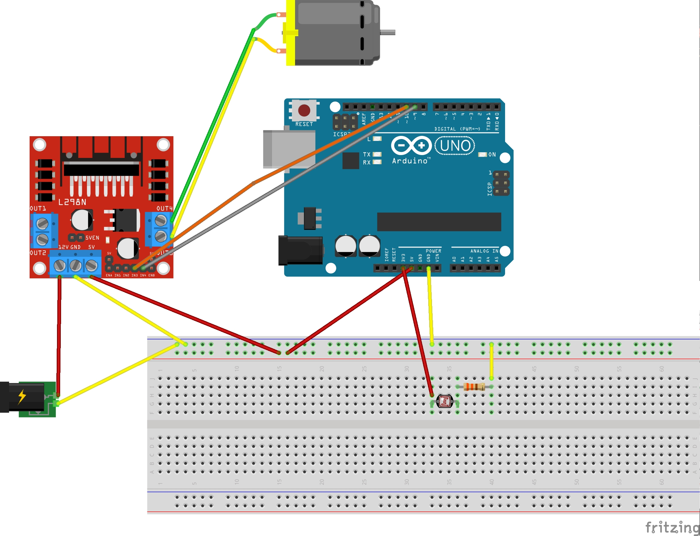

# Switchy

Switchy is an Arduino toy project allowing to switch on a wall switch when the light intensity in the room is lower than a specific threshold. This could be useful whenever  we want to power on a light bulb in a room when it gets dark without any smart bulb.

## Schema

What I used in order to set up the project is:

- Breadboard
- Photoresistor
- 33Kohm resistor
- External power supply DC 12V 300mA
- DC motor
- Arduino UNO
- L298N motor controller

## Working flow

The working flow of Switchy is quite simple. It checks the current value of light intensity every minute by means of the photoresistor. When the read value is under a configured threshold, the engine is enabled, and a stick, connected to it, allows to switch on the wall switch. This means that Switchy can be only used to power on the wall switch and it is not possible to power it off. Moreover, we are not able to configure a working time, whenever we don't want to have the light bulb powered on, we should disconnected the power supply.

## Possible improvements

It could be possible to add a Bluetooth module, in order to let the Arduino talk with an external device. This might allow to dynamically perform some configurations, such as specifying when we don't want to power on the light bulb, or configuring the desired light intensity threshold.

Enjoy!